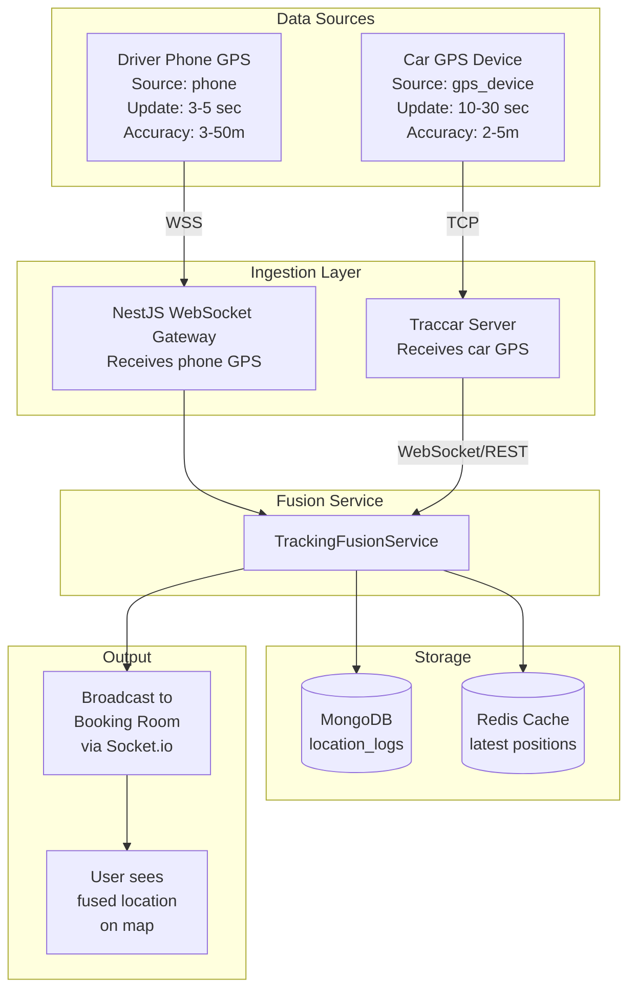
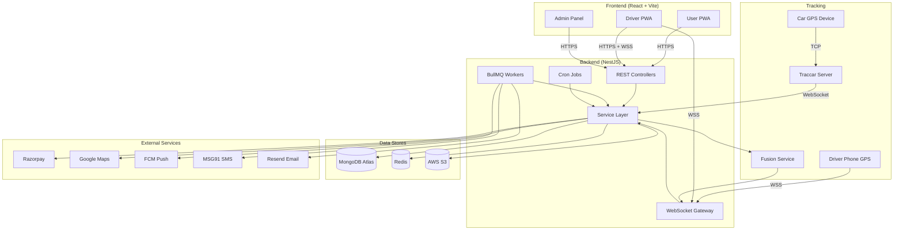
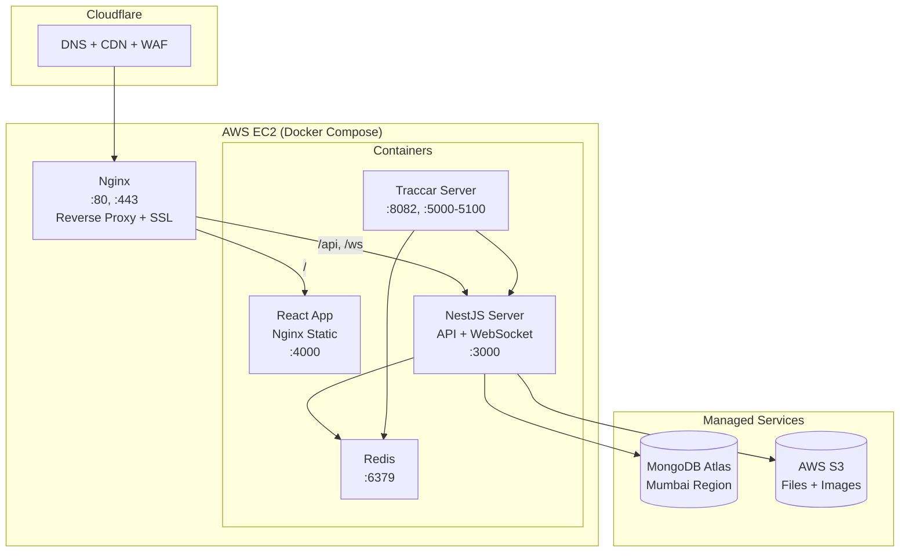

# Architecture & System Design

## Architecture Decision: Clean Frontend-Backend Separation

**React + TypeScript** (frontend PWA) + **NestJS** (entire backend — API, WebSocket, jobs, auth, payments).

### Why This Over Hybrid Next.js?

| Concern | Next.js Hybrid | React + NestJS |
|---------|---------------|----------------|
| Backend structure | Scattered API routes, no DI | Full DI, guards, pipes, interceptors |
| WebSocket | Hack via custom server | First-class `@nestjs/websockets` gateway |
| Background jobs | External process needed | `@nestjs/schedule` + `@nestjs/bull` built-in |
| Auth/RBAC | Manual middleware per route | httpOnly cookie sessions, `@UseGuards()` decorators |
| Business logic | No enforced patterns | Service → Controller → Module pattern |
| Testing | Limited API route testing | Full unit + e2e with Jest out of box |
| Resale/White-label | Tied to Next.js deployment | API is framework-agnostic, any frontend can consume |
| SEO | SSR built-in | Use prerender for landing page, or add SSR later |
| Real-time | Can't do persistent connections | Socket.io gateway with rooms, namespaces |
| Cron jobs | Needs separate process | `@Cron()` decorator, runs in same process |

### Why React (Vite) Over Next.js for Frontend?

- **Simpler** — No SSR complexity, no server/client component confusion
- **PWA-friendly** — Vite PWA plugin works perfectly, full control over service worker
- **Backend is NestJS** — No need for Next.js API routes, SSR adds unnecessary complexity
- **Faster dev** — Vite HMR is faster than Next.js dev server
- **Docker** — Single static build, served by Nginx (tiny image)
- **SEO** — Landing page can be pre-rendered at build time; app pages don't need SEO
- **White-label** — Static build + environment variables = easy to rebrand and deploy

---

## System Architecture

```
┌─────────────────────────────────────────────────────────────────────┐
│                     Client (Browser / PWA)                          │
│   React + TypeScript + Vite + Tailwind + shadcn/ui                 │
│   Service Worker (vite-plugin-pwa) + FCM Push                              │
└────────┬──────────────────────────────┬─────────────────────────────┘
         │ HTTPS (REST API)             │ WSS (WebSocket)
         ▼                              ▼
┌─────────────────────────────────────────────────────────────────────┐
│                        NestJS Backend                               │
│                                                                     │
│  ┌──────────────┐ ┌──────────────┐ ┌──────────────────────────┐    │
│  │ REST API     │ │ WebSocket    │ │ Background Workers       │    │
│  │ Controllers  │ │ Gateway      │ │                          │    │
│  │              │ │              │ │ - BullMQ job processors  │    │
│  │ - Auth       │ │ - GPS rooms  │ │ - Notification sender    │    │
│  │ - Bookings   │ │ - Status     │ │ - Reminder cron          │    │
│  │ - Cars       │ │   updates    │ │ - Doc expiry checker     │    │
│  │ - Drivers    │ │ - Live       │ │ - Location log cleanup   │    │
│  │ - Payments   │ │   notifications│ │                        │    │
│  │ - Users      │ │              │ │                          │    │
│  │ - Admin      │ │              │ │                          │    │
│  │ - Upload     │ │              │ │                          │    │
│  │ - Ratings    │ │              │ │                          │    │
│  └──────┬───────┘ └──────┬───────┘ └──────────┬───────────────┘    │
│         │                │                     │                    │
│  ┌──────▼────────────────▼─────────────────────▼───────────────┐   │
│  │                    Service Layer                             │   │
│  │  BookingService, PaymentService, TrackingService,           │   │
│  │  NotificationService, UserService, CarService, etc.         │   │
│  └──────────────────────────┬──────────────────────────────────┘   │
│                             │                                      │
└─────────────────────────────┼──────────────────────────────────────┘
                              │
         ┌────────────────────┼────────────────────┐
         ▼                    ▼                    ▼
┌──────────────┐  ┌──────────────────┐  ┌──────────────────┐
│ MongoDB Atlas │  │ Redis            │  │ AWS S3           │
│              │  │                  │  │                  │
│ - Users      │  │ - BullMQ queues  │  │ - Car photos     │
│ - Bookings   │  │ - Socket.io      │  │ - Documents      │
│ - Cars       │  │   adapter        │  │ - Driver photos  │
│ - Drivers    │  │ - Cache          │  │ - Receipts       │
│ - Payments   │  │ - Rate limiting  │  │                  │
│ - Ratings    │  │                  │  │                  │
│ - Locations  │  │                  │  │                  │
│ - Notifs     │  │                  │  │                  │
└──────────────┘  └──────────────────┘  └──────────────────┘
```

---

## GPS Tracker Architecture — Deep Analysis

Two tracking sources run simultaneously. Each has distinct hardware, protocols, accuracy, and failure modes.

### Tracker 1: Driver Phone GPS (Browser Geolocation API)

```
┌─────────────────────────────────────────────────────────┐
│              Driver's Phone (Android/iOS)                │
│                                                         │
│  ┌─────────────────────────────────────────────────┐    │
│  │          PWA (React App in Chrome)               │    │
│  │                                                   │    │
│  │  navigator.geolocation.watchPosition()           │    │
│  │        │                                          │    │
│  │        ▼                                          │    │
│  │  Filter: moved > 20m from last point?            │    │
│  │        │ YES                                      │    │
│  │        ▼                                          │    │
│  │  socket.emit('location:update', {                │    │
│  │    lat, lng, speed, heading,                     │    │
│  │    accuracy, timestamp, bookingId,               │    │
│  │    source: 'phone'                               │    │
│  │  })                                               │    │
│  └──────────┬────────────────────────────────────────┘    │
│             │ WSS                                         │
└─────────────┼─────────────────────────────────────────────┘
              ▼
┌─────────────────────────────────────────────────────────┐
│                NestJS WebSocket Gateway                   │
│                                                         │
│  @SubscribeMessage('location:update')                   │
│  handleLocationUpdate(client, payload) {                │
│    1. Validate session cookie from handshake                       │
│    2. Store in MongoDB (location_logs collection)       │
│    3. Broadcast to booking room:                        │
│       server.to(`booking:${bookingId}`)                 │
│              .emit('driver:location', payload)          │
│    4. Update driver.currentLocation in DB               │
│  }                                                      │
└─────────────────────────────────────────────────────────┘
              │
              ▼
┌─────────────────────────────────────────────────────────┐
│              User's Browser (React PWA)                  │
│                                                         │
│  socket.on('driver:location', (data) => {               │
│    updateMarkerPosition(data.lat, data.lng)             │
│    updateETA(data)                                       │
│  })                                                      │
│                                                         │
│  [Google Map with moving driver marker]                  │
└─────────────────────────────────────────────────────────┘
```

#### Phone GPS Specs

| Property | Detail |
|----------|--------|
| **Accuracy** | 3-10m (open sky), 10-50m (urban), 50-200m (indoor) |
| **Update interval** | Every 3-5 seconds (active ride), every 30s (idle) |
| **Battery impact** | High — continuous GPS drains ~15-20% per hour |
| **Data usage** | ~100 bytes/update × 720/hour = ~70KB/hour (negligible) |
| **Dependency** | Driver must keep PWA open in browser |
| **Failure modes** | Phone dies, app closed, poor GPS signal, no internet |
| **Wake Lock** | `navigator.wakeLock.request('screen')` prevents screen off |
| **Background** | Chrome Android: works if tab visible; killed if backgrounded |
| **iOS limitation** | Safari kills GPS when tab not visible; Home Screen PWA slightly better |

#### Phone GPS Mitigation Strategies

| Problem | Solution |
|---------|----------|
| App closed by driver | Auto-reconnect on open; show persistent notification via service worker |
| Phone battery dies | Car GPS tracker as backup (Tracker 2) |
| Poor GPS indoors | Fall back to cell tower location (less accurate) |
| Screen goes off | Wake Lock API keeps screen active during ride |
| Background kill (Android) | Use `keepalive` in service worker; prompt driver to keep app open |
| Background kill (iOS) | No reliable fix in PWA — future: native driver app |

---

### Tracker 2: Car GPS Hardware Device (via Traccar)

```
┌─────────────────────────────────────────────────────────┐
│                Car (Physical Hardware)                    │
│                                                         │
│  ┌──────────────────────────────────────────────┐       │
│  │        GPS Tracker Device                     │       │
│  │        (e.g., Concox GT06N)                   │       │
│  │                                                │       │
│  │  GPS Satellite → Lat/Lng fix                  │       │
│  │  + GPRS/2G SIM → Sends data via TCP           │       │
│  │                                                │       │
│  │  Sends every 10-30 seconds:                   │       │
│  │  - Latitude, Longitude                        │       │
│  │  - Speed, Heading                             │       │
│  │  - Ignition status (on/off)                   │       │
│  │  - Battery level                              │       │
│  │  - Timestamp                                   │       │
│  │  - Device IMEI (unique ID)                    │       │
│  └──────────┬───────────────────────────────────┘       │
│             │ TCP (GT06/Teltonika protocol)               │
└─────────────┼─────────────────────────────────────────────┘
              ▼
┌─────────────────────────────────────────────────────────┐
│              Traccar Server (Self-Hosted)                 │
│              Docker Container on EC2                     │
│                                                         │
│  Listening on ports 5000-5100 (various protocols)       │
│                                                         │
│  1. Receives raw GPS packet (GT06/Teltonika/etc.)       │
│  2. Decodes protocol → normalized position object       │
│  3. Stores in Traccar DB (H2/PostgreSQL)                │
│  4. Exposes REST API:                                    │
│     GET /api/positions?deviceId=X → latest position     │
│  5. WebSocket /api/socket → real-time position stream   │
│                                                         │
│  Supports 200+ GPS protocols, 2000+ device models       │
└──────────┬──────────────────────────────────────────────┘
           │ Traccar WebSocket or REST polling
           ▼
┌─────────────────────────────────────────────────────────┐
│              NestJS Tracking Service                     │
│                                                         │
│  TraccarGatewayService:                                  │
│  - Connects to Traccar WebSocket on startup             │
│  - On new position from device:                         │
│    1. Map device IMEI → carId (from cars collection)    │
│    2. Find active booking for this car                  │
│    3. Store in MongoDB (location_logs, source: 'gps')   │
│    4. Broadcast to booking room:                        │
│       server.to(`booking:${bookingId}`)                 │
│              .emit('car:location', position)            │
│    5. Update car.lastKnownLocation in DB                │
│                                                         │
│  Health monitor:                                         │
│  - Alert admin if device offline > 10 minutes           │
│  - Alert if device battery < 20%                        │
│  - Geofence alerts (car leaves city boundary)           │
└─────────────────────────────────────────────────────────┘
```

#### Car GPS Hardware Specs

| Property | Detail |
|----------|--------|
| **Accuracy** | 2-5m (always open sky on roof/dashboard) |
| **Update interval** | 10-30 seconds (configurable) |
| **Battery** | Wired to car battery (always on); backup battery 4-8 hours |
| **Data usage** | ~2-5MB/month via 2G SIM |
| **SIM cost** | ₹50-150/month (IoT/M2M plan) |
| **Device cost** | ₹2,000-5,000 one-time per car |
| **Dependency** | Car must have power; 2G/4G signal available |
| **Failure modes** | SIM expires, device malfunction, no cellular coverage (tunnels), car battery dead |
| **Tamper protection** | Hardwired devices send alert if disconnected |
| **Extra features** | Ignition on/off, over-speed alert, geofence, mileage |

#### Popular GPS Devices for India

| Device | Price | Protocol | Connectivity | Features |
|--------|-------|----------|-------------|----------|
| **Concox GT06N** | ₹2,500-3,500 | GT06 | 2G GPRS | Budget, reliable, wide Traccar support |
| **Jimilab JM-VL01** | ₹2,000-3,000 | Jimi | 2G GPRS | Cheapest, basic tracking |
| **Teltonika FMB920** | ₹4,000-6,000 | Teltonika | 2G/4G | Premium, OBD data, best accuracy |
| **Queclink GV20** | ₹3,500-5,000 | Queclink | 2G/4G | Waterproof, hardwired |
| **Onelap Go** | ₹3,000-4,000 | Custom | 4G | India-made, good API, OBD-II |

#### Recommended for MVP: **Concox GT06N** (₹2,500) + Airtel IoT SIM (₹100/month)

---

### Dual Tracker Fusion — How Both Work Together



#### Fusion Logic (TrackingFusionService)

```
On receiving position from either source:

1. Store raw position in location_logs (with source tag)

2. Get latest positions from BOTH sources (from Redis cache)

3. Determine "best" position:
   - If both available and within 60 seconds:
     → Use car GPS (higher accuracy, always on dashboard)
     → Keep phone GPS as validation
   - If only phone GPS available:
     → Use phone GPS (car device may be starting up)
   - If only car GPS available:
     → Use car GPS (driver app may be closed)
   - If neither available for > 2 minutes:
     → Mark tracking as "stale", alert admin

4. Broadcast fused position to booking room

5. Detect anomalies:
   - Phone and car GPS > 500m apart → alert (possible wrong car/driver)
   - Speed > 120 km/h → over-speed alert
   - No updates > 5 min → connectivity issue alert
```

#### Tracker Comparison Summary

| Feature | Phone GPS | Car GPS Device |
|---------|-----------|---------------|
| **Cost** | ₹0 (uses driver's phone) | ₹2,500-5,000 + ₹100/month SIM |
| **Accuracy** | 3-50m (varies) | 2-5m (consistent) |
| **Reliability** | Low (app can close, battery die) | High (wired to car, always on) |
| **Update frequency** | 3-5 sec (fast) | 10-30 sec (slower) |
| **Setup** | Zero hardware | Install device, configure Traccar |
| **Works when car off** | No | Yes (backup battery 4-8 hrs) |
| **Background tracking** | Poor on iOS, OK on Android | Always works |
| **Extra data** | Speed, heading | Speed, heading, ignition, fuel, mileage |
| **Tamper detection** | None | Alert if disconnected |
| **Driver privacy** | Tracks phone, not car | Tracks car, not driver personally |
| **MVP priority** | P0 (launch with this) | P1 (add in month 2) |

---

## High-Level Architecture Diagram (Mermaid)



## Deployment Architecture



## Docker Compose Layout

```
EC2 Instance (t2.micro / t3.micro)
├── Docker Compose
│   ├── nginx:alpine          (port 80, 443)
│   │   ├── / → react-app:4000         (static frontend)
│   │   ├── /api → nestjs:3000         (REST API)
│   │   └── /ws → nestjs:3000          (WebSocket upgrade)
│   │
│   ├── react-app             (port 4000)
│   │   └── Nginx serving built React static files
│   │
│   ├── nestjs-api            (port 3000)
│   │   ├── REST API controllers
│   │   ├── WebSocket gateway (Socket.io)
│   │   ├── BullMQ workers
│   │   ├── Cron scheduler
│   │   └── Traccar WebSocket client
│   │
│   ├── traccar               (port 8082, 5000-5100)
│   │   └── GPS device protocol listeners
│   │
│   └── redis:7-alpine        (port 6379)
│       └── BullMQ queues, Socket.io adapter, cache
│
├── Volumes
│   ├── nginx-ssl/            (Let's Encrypt certs)
│   ├── traccar-data/         (GPS data persistence)
│   └── redis-data/           (queue persistence)
│
└── External
    ├── MongoDB Atlas (Mumbai, M0 free)
    └── AWS S3 (ap-south-1)
```

## NestJS Module Structure

```
nestjs-api/
├── src/
│   ├── main.ts
│   ├── app.module.ts
│   │
│   ├── auth/
│   │   ├── auth.module.ts
│   │   ├── auth.controller.ts      # Login, OTP, register, logout
│   │   ├── auth.service.ts         # Session create/destroy/validate
│   │   ├── session.middleware.ts    # Read cookie → lookup session → attach user
│   │   ├── session-auth.guard.ts   # Reject if no session
│   │   ├── roles.guard.ts          # @Roles('admin', 'driver')
│   │   └── schemas/session.schema.ts # MongoDB session with TTL index
│   │
│   ├── users/
│   │   ├── users.module.ts
│   │   ├── users.controller.ts
│   │   ├── users.service.ts
│   │   └── schemas/user.schema.ts
│   │
│   ├── cars/
│   │   ├── cars.module.ts
│   │   ├── cars.controller.ts
│   │   ├── cars.service.ts
│   │   └── schemas/car.schema.ts
│   │
│   ├── drivers/
│   │   ├── drivers.module.ts
│   │   ├── drivers.controller.ts
│   │   ├── drivers.service.ts
│   │   └── schemas/driver.schema.ts
│   │
│   ├── bookings/
│   │   ├── bookings.module.ts
│   │   ├── bookings.controller.ts
│   │   ├── bookings.service.ts
│   │   └── schemas/booking.schema.ts
│   │
│   ├── payments/
│   │   ├── payments.module.ts
│   │   ├── payments.controller.ts   # Razorpay create/verify
│   │   ├── payments.service.ts
│   │   ├── webhooks.controller.ts   # Razorpay webhooks
│   │   └── schemas/payment.schema.ts
│   │
│   ├── tracking/
│   │   ├── tracking.module.ts
│   │   ├── tracking.gateway.ts      # @WebSocketGateway — phone GPS
│   │   ├── traccar.service.ts       # Connect to Traccar — car GPS
│   │   ├── fusion.service.ts        # Merge both tracker sources
│   │   └── schemas/location-log.schema.ts
│   │
│   ├── notifications/
│   │   ├── notifications.module.ts
│   │   ├── notifications.service.ts
│   │   ├── push.service.ts          # FCM
│   │   ├── sms.service.ts           # MSG91
│   │   ├── email.service.ts         # Resend
│   │   └── notification.processor.ts # BullMQ worker
│   │
│   ├── ratings/
│   │   ├── ratings.module.ts
│   │   ├── ratings.controller.ts
│   │   └── ratings.service.ts
│   │
│   ├── upload/
│   │   ├── upload.module.ts
│   │   ├── upload.controller.ts     # S3 presigned URLs
│   │   └── upload.service.ts
│   │
│   ├── admin/
│   │   ├── admin.module.ts
│   │   ├── admin.controller.ts      # Dashboard stats, settings
│   │   └── admin.service.ts
│   │
│   └── common/
│       ├── decorators/              # @Roles(), @CurrentUser()
│       ├── filters/                 # Global exception filter
│       ├── interceptors/            # Logging, transform
│       └── pipes/                   # Validation pipe
│
├── Dockerfile
├── package.json
├── tsconfig.json
├── nest-cli.json
└── .env
```

## React Frontend Structure

```
react-app/
├── src/
│   ├── main.tsx
│   ├── App.tsx
│   ├── router.tsx                   # React Router v7
│   │
│   ├── pages/
│   │   ├── public/
│   │   │   ├── Landing.tsx
│   │   │   ├── Login.tsx
│   │   │   └── Register.tsx
│   │   ├── user/
│   │   │   ├── Dashboard.tsx
│   │   │   ├── BookRide.tsx
│   │   │   ├── MyBookings.tsx
│   │   │   ├── BookingDetail.tsx
│   │   │   ├── LiveTracking.tsx
│   │   │   └── Profile.tsx
│   │   ├── driver/
│   │   │   ├── DriverDashboard.tsx
│   │   │   ├── RideDetail.tsx
│   │   │   └── Navigation.tsx
│   │   └── admin/
│   │       ├── AdminDashboard.tsx
│   │       ├── ManageCars.tsx
│   │       ├── ManageDrivers.tsx
│   │       ├── ManageUsers.tsx
│   │       ├── AllBookings.tsx
│   │       ├── Payments.tsx
│   │       └── Settings.tsx
│   │
│   ├── components/
│   │   ├── ui/                      # shadcn/ui components
│   │   ├── booking/
│   │   ├── maps/
│   │   │   ├── BookingMap.tsx
│   │   │   ├── LiveTrackingMap.tsx
│   │   │   ├── PlaceAutocomplete.tsx
│   │   │   └── DriverMarker.tsx
│   │   ├── admin/
│   │   └── layout/
│   │       ├── AppLayout.tsx
│   │       ├── AdminLayout.tsx
│   │       └── DriverLayout.tsx
│   │
│   ├── hooks/
│   │   ├── useAuth.ts
│   │   ├── useSocket.ts
│   │   ├── useGeolocation.ts
│   │   └── useBooking.ts
│   │
│   ├── services/
│   │   ├── api.ts                   # Axios instance + interceptors
│   │   ├── auth.api.ts
│   │   ├── booking.api.ts
│   │   ├── car.api.ts
│   │   ├── payment.api.ts
│   │   └── socket.ts               # Socket.io client
│   │
│   ├── store/                       # Redux Toolkit + Saga
│   │   ├── store.ts                 # configureStore + sagaMiddleware
│   │   ├── rootSaga.ts              # all sagas combined
│   │   ├── slices/
│   │   │   ├── authSlice.ts
│   │   │   ├── bookingSlice.ts
│   │   │   ├── carsSlice.ts
│   │   │   ├── driversSlice.ts
│   │   │   ├── trackingSlice.ts
│   │   │   ├── notificationSlice.ts
│   │   │   ├── adminSlice.ts
│   │   │   └── uiSlice.ts
│   │   └── sagas/
│   │       ├── authSaga.ts          # login, OTP, token refresh
│   │       ├── bookingSaga.ts       # create → pay → confirm
│   │       ├── paymentSaga.ts       # Razorpay orchestration
│   │       ├── trackingSaga.ts      # WebSocket eventChannel GPS
│   │       ├── notificationSaga.ts  # push permission, FCM token
│   │       └── adminSaga.ts         # CRUD operations
│   │
│   ├── types/
│   │   └── index.ts                 # Shared TypeScript interfaces
│   │
│   └── lib/
│       ├── utils.ts
│       └── constants.ts
│
├── public/
│   ├── manifest.json
│   ├── sw.js
│   └── icons/
│
├── Dockerfile
├── package.json
├── vite.config.ts
├── tailwind.config.ts
└── tsconfig.json
```

## Data Flow Diagrams

### Booking Flow
```
User (React) → POST /api/bookings → NestJS BookingController
  → BookingService.create() → Validate dates, check car availability
  → MongoDB: create booking (status: pending)
  → PaymentService.createOrder() → Razorpay API: create order
  → Return orderId to frontend

Frontend → Razorpay Checkout (UPI payment)
  → User pays → Razorpay redirects back

Razorpay → POST /api/webhooks/razorpay → NestJS WebhookController
  → Verify HMAC signature
  → PaymentService.capturePayment() → MongoDB: update payment + booking
  → NotificationService.queue('booking_confirmed', bookingId)
  → BullMQ Worker processes → FCM push + SMS via MSG91
```

### Real-Time Tracking Flow
```
Driver Phone:
  watchPosition() → socket.emit('location:update')
  → NestJS TrackingGateway → FusionService

Car GPS Device:
  GT06N → TCP packet → Traccar :5013
  → Traccar WebSocket → NestJS TraccarService → FusionService

FusionService:
  → Compare both sources, pick best
  → Store in MongoDB (location_logs)
  → Cache in Redis (latest position)
  → Broadcast to booking room
  → User sees marker move on map
```

## Scaling Strategy

| Users | Architecture | Est. Cost |
|-------|-------------|-----------|
| 1-100 | Single EC2 (t2.micro) + MongoDB M0 | ₹0-500/mo |
| 100-1K | EC2 t3.small + MongoDB M2 + Redis | ₹2,000-4,000/mo |
| 1K-5K | 2 EC2 + ALB + MongoDB M10 + ElastiCache | ₹10,000-20,000/mo |
| 5K+ | ECS/EKS + MongoDB Atlas dedicated + ElastiCache | ₹30,000+/mo |

### Horizontal Scaling Notes
- NestJS: stateless — add more instances behind load balancer
- Socket.io: add `@socket.io/redis-adapter` for multi-instance rooms
- BullMQ: workers can run on separate instances
- Traccar: single instance sufficient for 500+ devices
- React: static files on CDN, infinite scale
