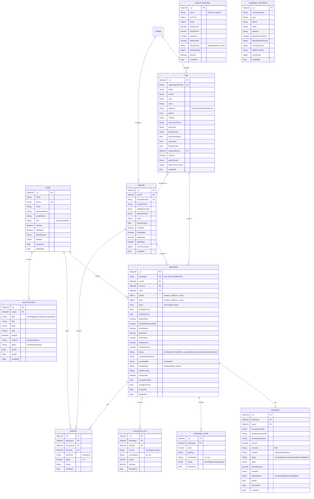

# Database Design (MongoDB)

## ER Diagram



## Collection Details

### users
```javascript
{
  _id: ObjectId,
  name: String,           // required
  phone: String,          // required, unique, indexed
  email: String,          // optional, unique sparse index
  passwordHash: String,   // bcrypt
  profilePhoto: String,   // S3 URL
  role: {
    type: String,
    enum: ['user', 'driver', 'admin'],
    default: 'user'
  },
  isActive: { type: Boolean, default: true },
  isBlocked: { type: Boolean, default: false },
  blockReason: String,
  address: {
    street: String,
    city: String,
    state: String,
    pincode: String
  },
  fcmTokens: [String],   // push notification tokens (multiple devices)
  lastLogin: Date,
  createdAt: Date,
  updatedAt: Date
}
// Indexes: { phone: 1 }, { email: 1 }, { role: 1 }
```

### drivers
```javascript
{
  _id: ObjectId,
  userId: { type: ObjectId, ref: 'User', required: true },
  licenseNumber: String,    // unique
  licensePhoto: String,     // S3 URL
  licenseExpiry: Date,
  aadhaarNumber: String,    // encrypted
  aadhaarPhoto: String,     // S3 URL
  photo: String,            // S3 URL
  isVerified: { type: Boolean, default: false },
  isAvailable: { type: Boolean, default: true },
  avgRating: { type: Number, default: 0 },
  totalRides: { type: Number, default: 0 },
  currentLocation: {
    type: { type: String, default: 'Point' },
    coordinates: [Number]   // [lng, lat]
  },
  createdAt: Date
}
// Indexes: { userId: 1 }, { currentLocation: '2dsphere' }, { isAvailable: 1 }
```

### cars
```javascript
{
  _id: ObjectId,
  registrationNumber: String,  // unique, e.g., "MP09AB1234"
  make: String,                // "Maruti"
  model: String,               // "Swift Dzire"
  year: Number,                // 2023
  color: String,
  category: {
    type: String,
    enum: ['sedan', 'suv', 'hatchback', 'tempo_traveller', 'luxury']
  },
  seats: Number,               // 4, 6, 8
  photos: [String],            // S3 URLs
  documents: {
    rc: { url: String, expiry: Date },
    insurance: { url: String, expiry: Date },
    puc: { url: String, expiry: Date },
    fitness: { url: String, expiry: Date }
  },
  assignedDriver: { type: ObjectId, ref: 'Driver' },
  isActive: { type: Boolean, default: true },
  gpsDeviceId: String,         // Traccar device ID
  lastKnownLocation: {
    type: { type: String, default: 'Point' },
    coordinates: [Number]
  },
  createdAt: Date,
  updatedAt: Date
}
// Indexes: { registrationNumber: 1 }, { category: 1 }, { isActive: 1 }
```

### bookings
```javascript
{
  _id: ObjectId,
  bookingId: String,          // "BK-20260503-001" auto-generated
  user: { type: ObjectId, ref: 'User' },
  driver: { type: ObjectId, ref: 'Driver' },
  car: { type: ObjectId, ref: 'Car' },
  pickup: {
    address: String,
    coordinates: { type: { type: String }, coordinates: [Number] },
    landmark: String
  },
  drop: {
    address: String,
    coordinates: { type: { type: String }, coordinates: [Number] },
    landmark: String
  },
  stops: [{
    order: Number,
    address: String,
    coordinates: { type: { type: String }, coordinates: [Number] },
    status: { type: String, enum: ['pending', 'reached', 'skipped'] },
    reachedAt: Date
  }],
  schedule: {
    startDate: Date,          // required
    startTime: String,        // "09:00"
    endDate: Date,            // for multi-day
    endTime: String
  },
  distance: {
    estimated: Number,        // km
    actual: Number            // km (after ride)
  },
  pricing: {
    pricePerKm: Number,
    baseFare: Number,
    distanceCharge: Number,
    tollEstimate: Number,
    totalAmount: Number,
    gstAmount: Number
  },
  status: {
    type: String,
    enum: [
      'pending',              // just created
      'confirmed',            // payment done
      'driver_assigned',      // driver accepted
      'driver_en_route',      // driver going to pickup
      'picked_up',            // user picked up
      'in_progress',          // ride ongoing
      'completed',            // ride finished
      'cancelled',            // cancelled by user/admin
      'refunded'              // refund processed
    ],
    default: 'pending'
  },
  cancellation: {
    cancelledBy: String,      // 'user' | 'admin' | 'driver'
    reason: String,
    cancelledAt: Date,
    refundPolicy: String,     // 'full' | 'partial' | 'none'
    refundPercentage: Number,
    refundAmount: Number
  },
  extension: {
    isExtended: Boolean,
    newDrop: Object,
    additionalAmount: Number,
    additionalPaymentId: String
  },
  actualTimes: {
    driverStarted: Date,
    pickedUp: Date,
    completed: Date
  },
  createdAt: Date,
  updatedAt: Date
}
// Indexes: { bookingId: 1 }, { user: 1 }, { driver: 1 }, { car: 1 },
//          { status: 1 }, { 'schedule.startDate': 1 }, { car: 1, status: 1, 'schedule.startDate': 1 }
```

### payments
```javascript
{
  _id: ObjectId,
  booking: { type: ObjectId, ref: 'Booking' },
  user: { type: ObjectId, ref: 'User' },
  razorpay: {
    orderId: String,
    paymentId: String,
    signature: String
  },
  amount: Number,           // in paise (₹100 = 10000)
  currency: { type: String, default: 'INR' },
  method: String,           // 'upi', 'card', 'netbanking'
  upiId: String,            // if UPI
  status: {
    type: String,
    enum: ['created', 'authorized', 'captured', 'refunded', 'partial_refund', 'failed']
  },
  refund: {
    refundId: String,
    amount: Number,
    status: String,         // 'initiated', 'processed', 'failed'
    processedAt: Date
  },
  paidAt: Date,
  createdAt: Date
}
// Indexes: { 'razorpay.orderId': 1 }, { booking: 1 }, { user: 1 }
```

## Indexing Strategy

### Compound Indexes (Performance Critical)
```javascript
// Car availability check (most frequent query)
db.bookings.createIndex({
  car: 1,
  status: 1,
  'schedule.startDate': 1,
  'schedule.endDate': 1
})

// User's bookings
db.bookings.createIndex({ user: 1, createdAt: -1 })

// Driver's bookings
db.bookings.createIndex({ driver: 1, status: 1, 'schedule.startDate': 1 })

// Location tracking (time-series like)
db.locationLogs.createIndex({ bookingId: 1, timestamp: -1 })

// Geospatial
db.drivers.createIndex({ currentLocation: '2dsphere' })
```

## Data Retention
- **Bookings**: Keep forever (audit trail)
- **Location logs**: Keep 90 days, then archive to S3
- **Notifications**: Keep 30 days read, 7 days unread
- **Payment records**: Keep forever (legal requirement)

## Soft Delete
Use `isActive: false` for cars, drivers. Use `isBlocked: true` for users. Never hard delete data.

## Seed Data for MVP
- 1 admin user
- 1 driver with documents
- 1 car with documents
- 5 popular routes with pricing (Indore ↔ Bhopal, Ujjain, Dewas, Omkareshwar, Airport)
- Company settings with branding
