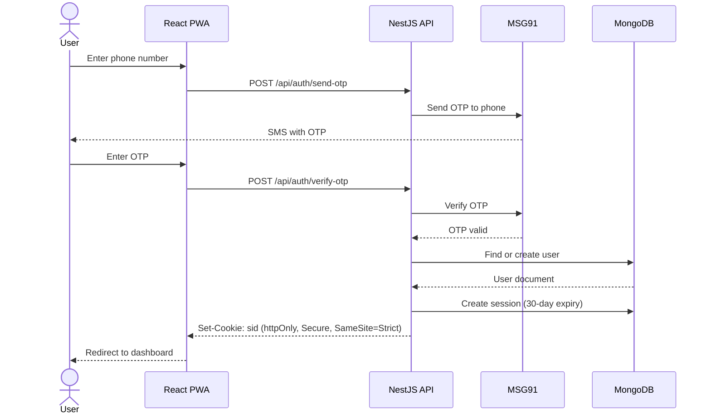
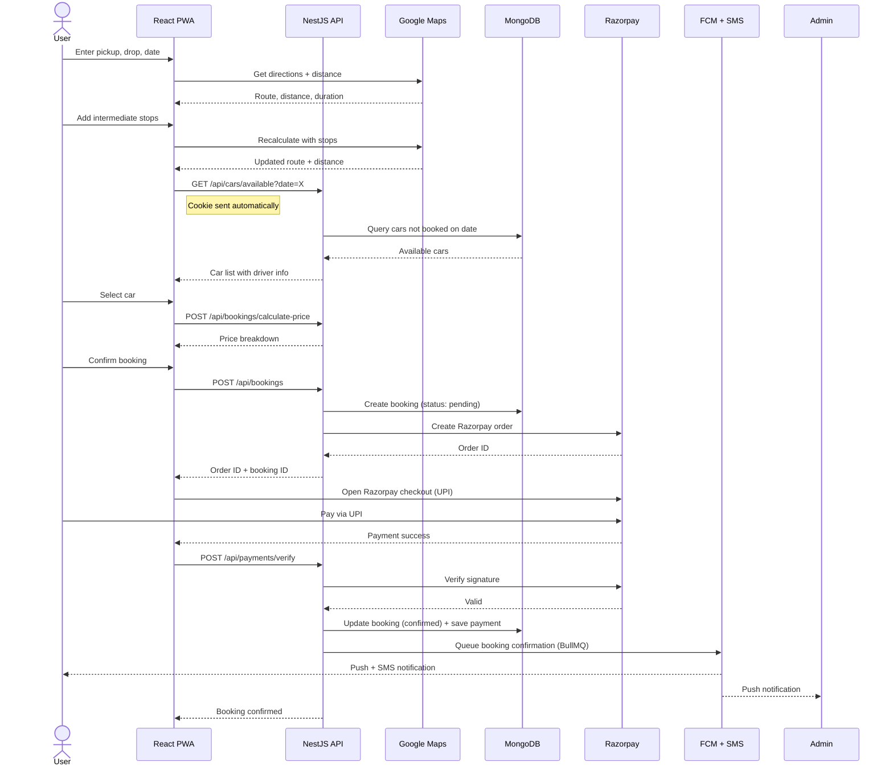
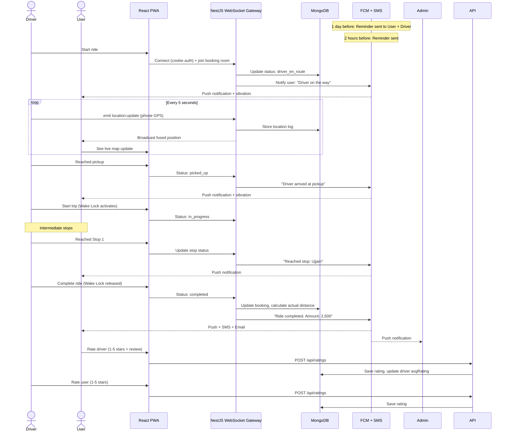
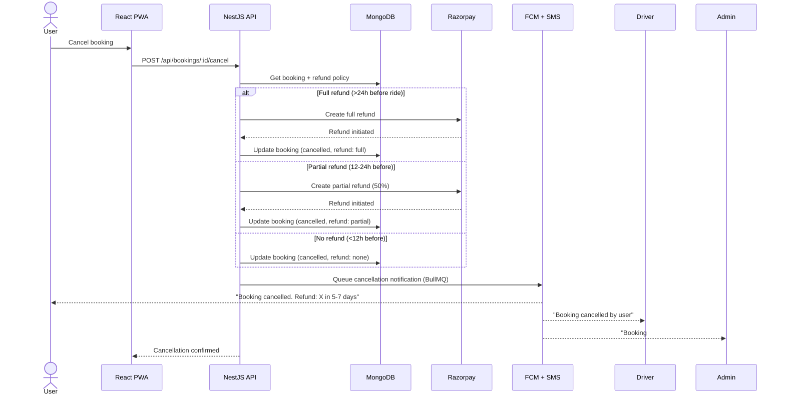
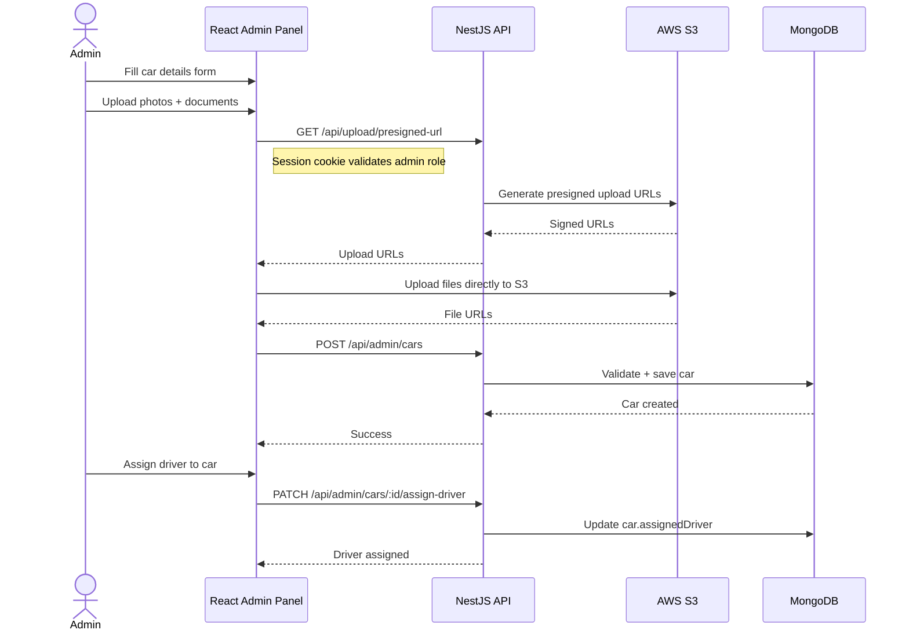
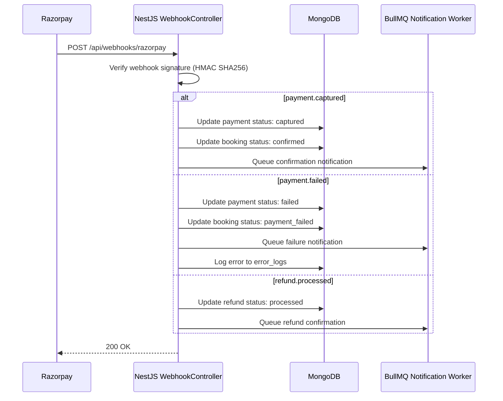
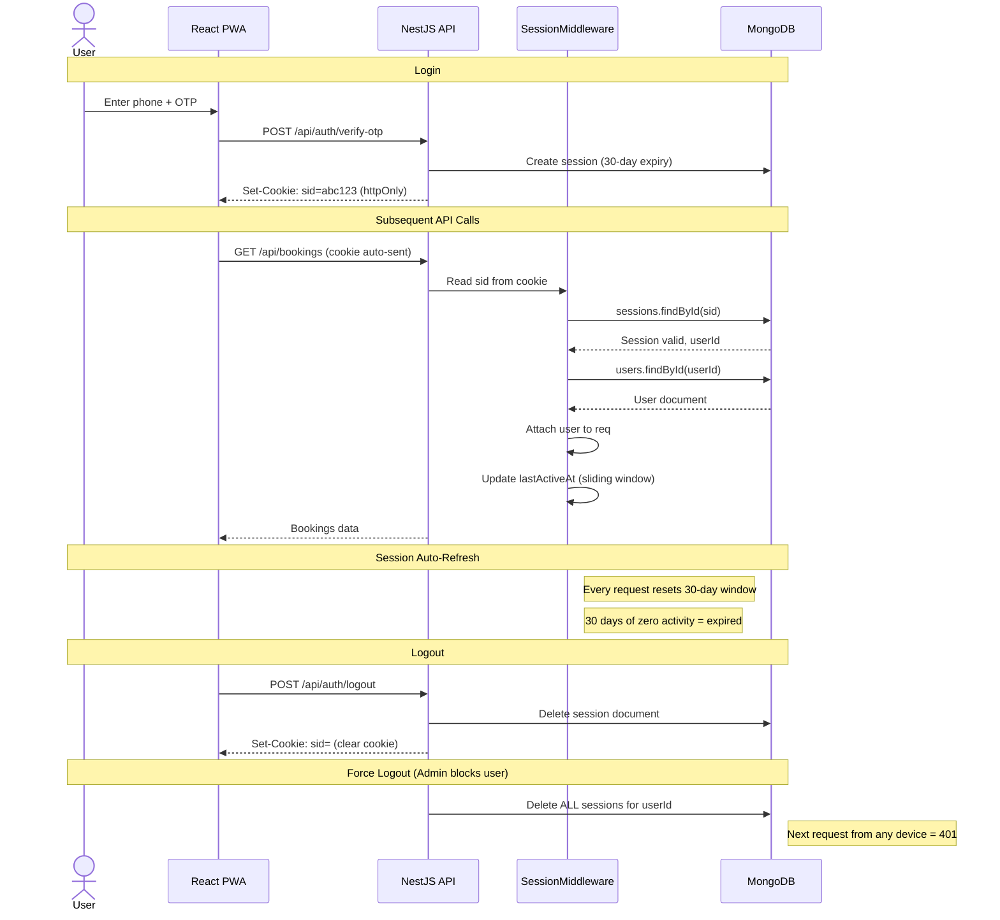
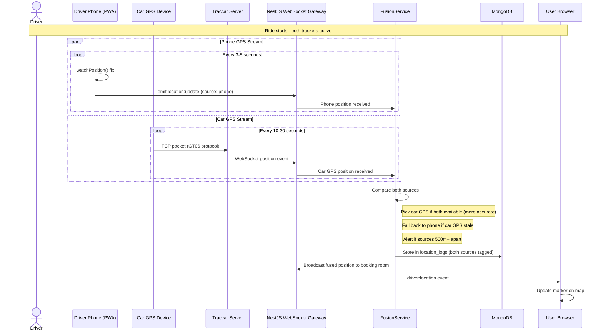

# Sequence Diagrams

## 1. User Registration (Phone OTP)

## 2. Booking Flow

## 3. Ride Day Flow

## 4. Cancellation + Refund Flow

## 5. Admin: Add Car Flow

## 6. Payment Webhook Flow

## 7. Session Auth Flow (BFF Cookie)

## 8. Dual GPS Tracking Flow

