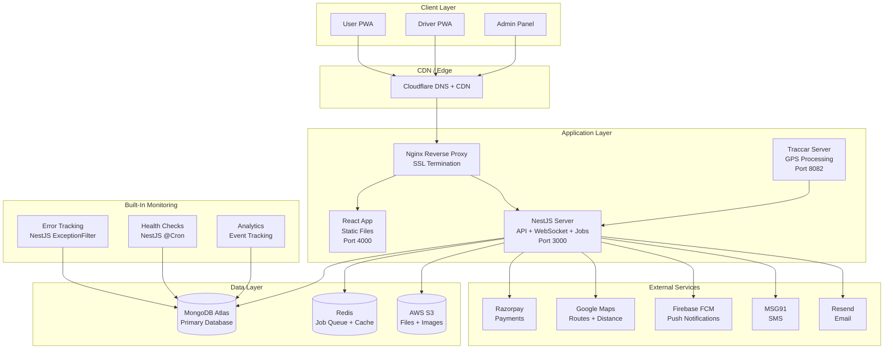
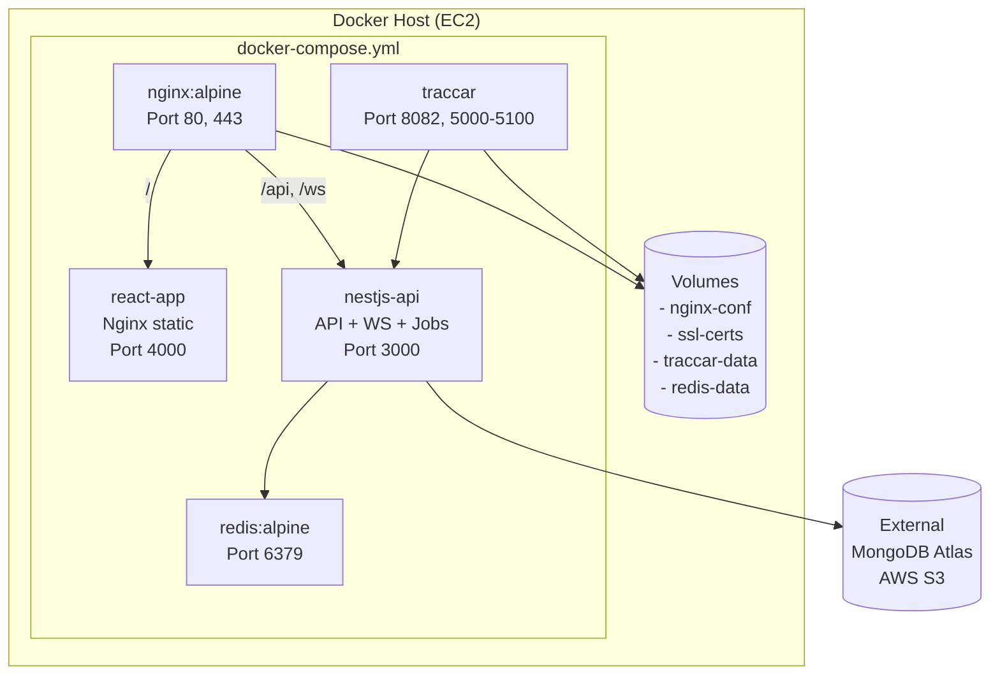
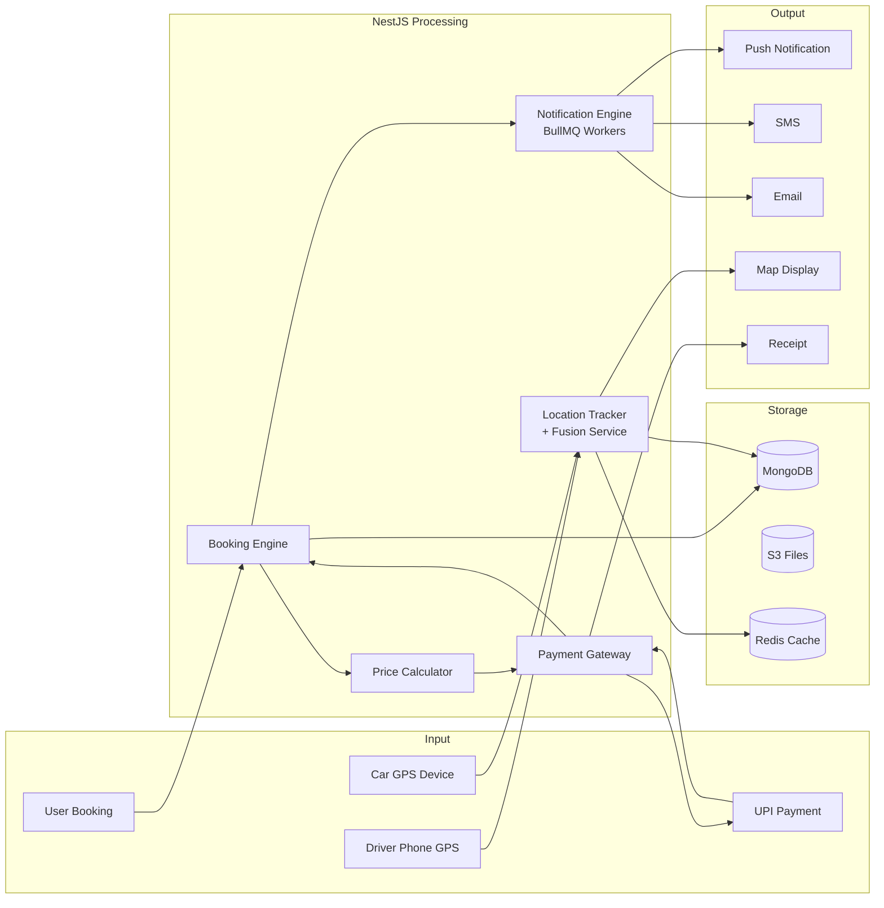
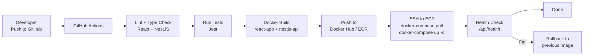
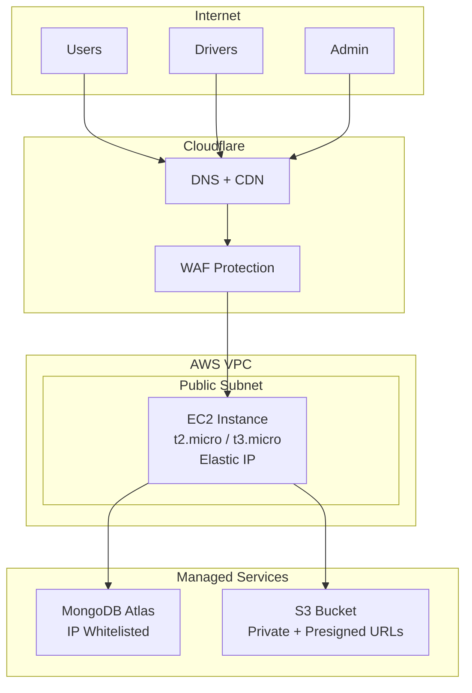

# Project Flow & Architecture Diagrams

## High-Level System Architecture



## Docker Compose Architecture



## Data Flow Diagram



## CI/CD Pipeline Flow



## Network Topology



## Folder Structure

```
cab-booking-app/
├── docker-compose.yml
├── docker-compose.prod.yml
├── .github/
│   └── workflows/
│       ├── ci.yml
│       └── deploy.yml
├── nginx/
│   ├── nginx.conf
│   └── ssl/
│
├── react-app/                       # React + Vite Frontend
│   ├── Dockerfile
│   ├── package.json
│   ├── vite.config.ts
│   ├── tailwind.config.ts
│   ├── public/
│   │   ├── manifest.json
│   │   └── icons/
│   ├── src/
│   │   ├── main.tsx
│   │   ├── App.tsx
│   │   ├── router.tsx               # React Router v7
│   │   ├── pages/
│   │   │   ├── public/              # Landing, Login, Register
│   │   │   ├── user/                # Dashboard, BookRide, Bookings, Tracking
│   │   │   ├── driver/              # DriverDashboard, RideDetail, Navigation
│   │   │   └── admin/               # Dashboard, Cars, Drivers, Users, Settings
│   │   ├── components/
│   │   │   ├── ui/                  # shadcn/ui components
│   │   │   ├── booking/
│   │   │   ├── maps/
│   │   │   ├── admin/
│   │   │   └── layout/
│   │   ├── hooks/
│   │   ├── services/
│   │   │   ├── api.ts               # Axios (withCredentials: true)
│   │   │   ├── socket.ts            # Socket.io client
│   │   │   └── analytics.ts         # Event tracker
│   │   ├── store/                   # Redux Toolkit + Saga
│   │   │   ├── store.ts
│   │   │   ├── rootSaga.ts
│   │   │   ├── slices/              # auth, booking, cars, tracking, ui...
│   │   │   └── sagas/               # auth, booking, payment, tracking...
│   │   └── types/
│   └── tsconfig.json
│
├── nestjs-api/                      # NestJS Backend (ALL server logic)
│   ├── Dockerfile
│   ├── package.json
│   ├── nest-cli.json
│   ├── src/
│   │   ├── main.ts
│   │   ├── app.module.ts
│   │   ├── auth/                    # Cookie sessions, OTP, guards
│   │   ├── users/
│   │   ├── cars/
│   │   ├── drivers/
│   │   ├── bookings/
│   │   ├── payments/                # Razorpay + webhooks
│   │   ├── tracking/                # WebSocket gateway + Traccar + fusion
│   │   ├── notifications/           # FCM, MSG91, Resend + BullMQ workers
│   │   ├── ratings/
│   │   ├── upload/                  # S3 presigned URLs
│   │   ├── admin/                   # Dashboard stats, settings
│   │   ├── monitoring/              # Error logs, health checks, analytics
│   │   └── common/                  # Guards, filters, interceptors, pipes
│   └── tsconfig.json
│
└── traccar/                         # GPS Tracker Server
    └── traccar.xml
```
