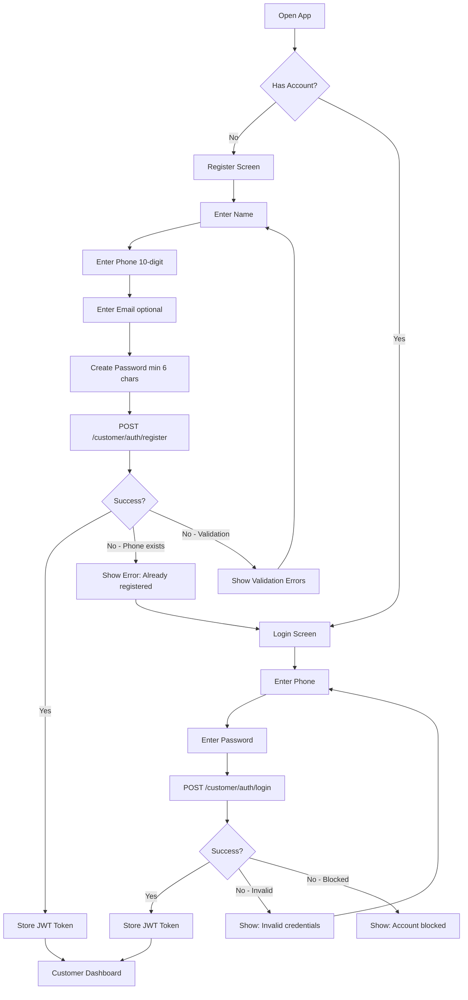
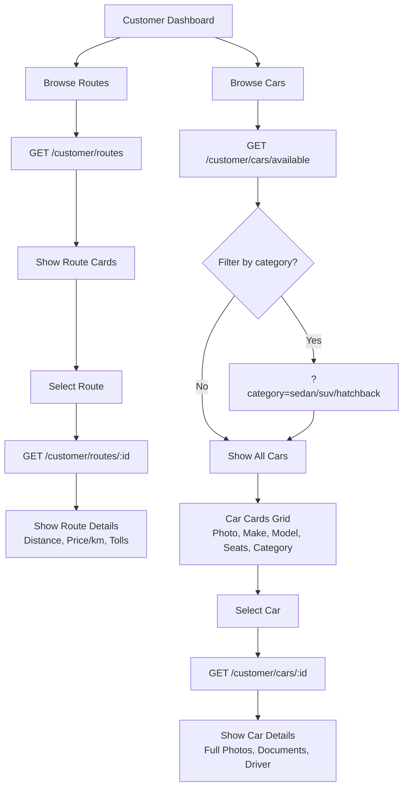
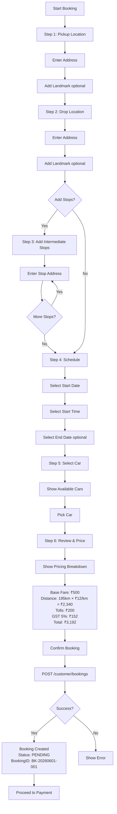
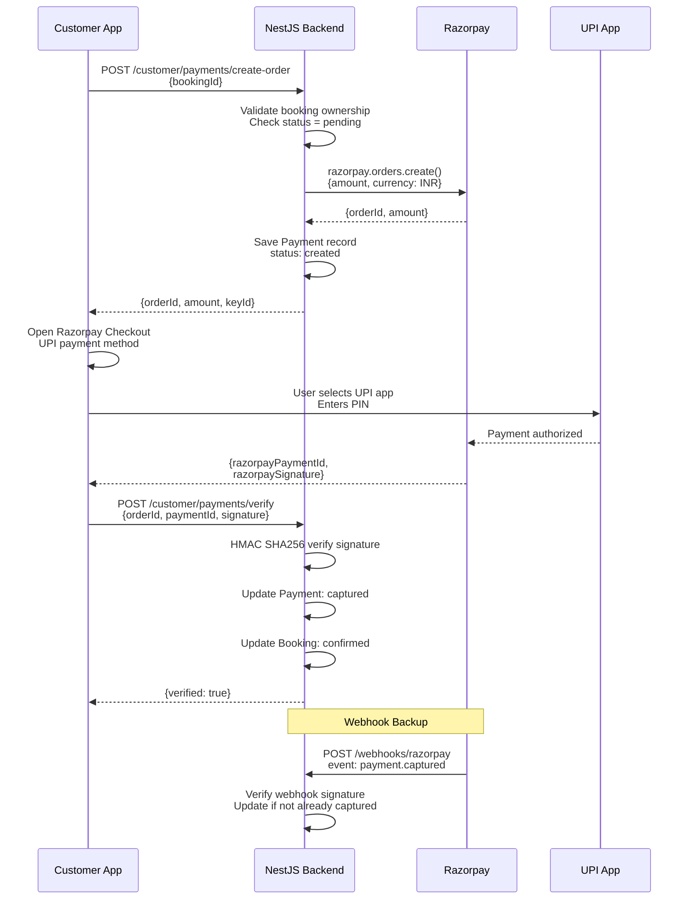
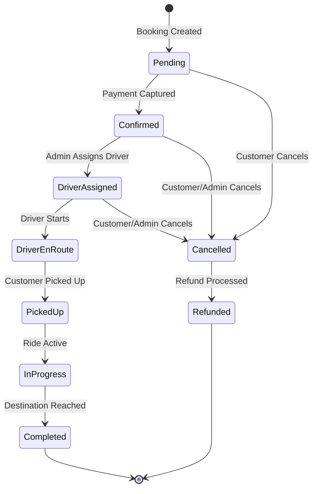
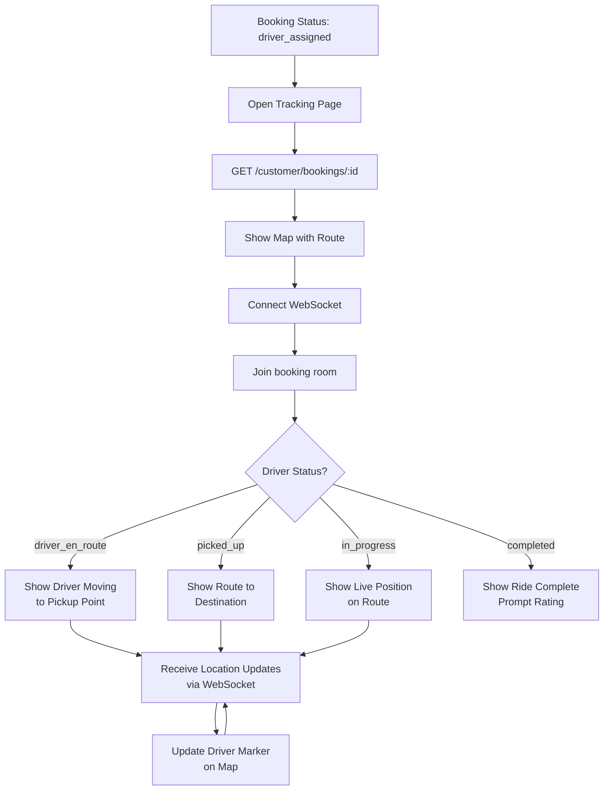
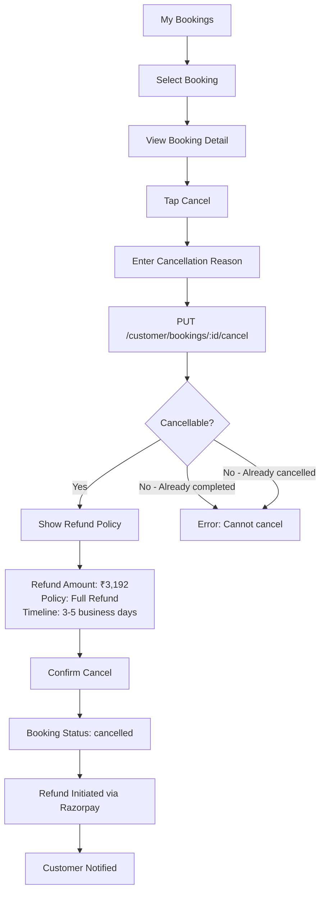
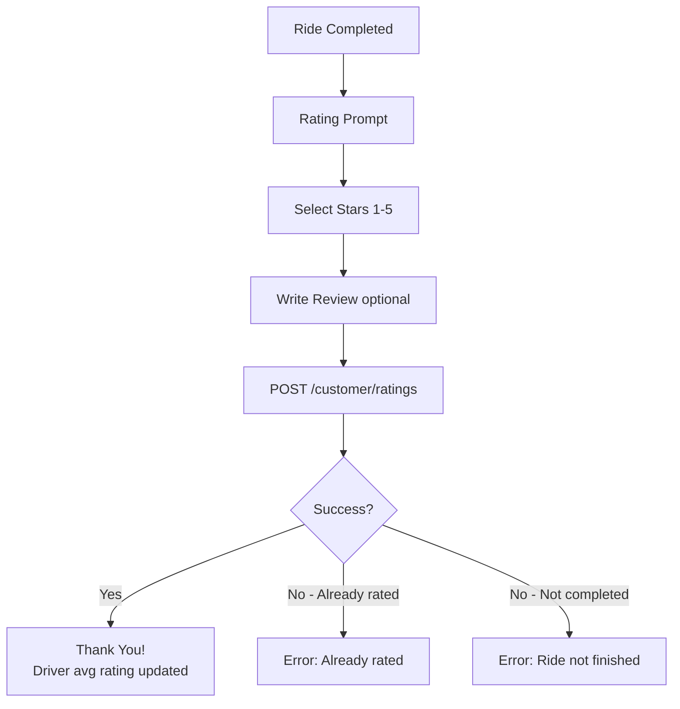
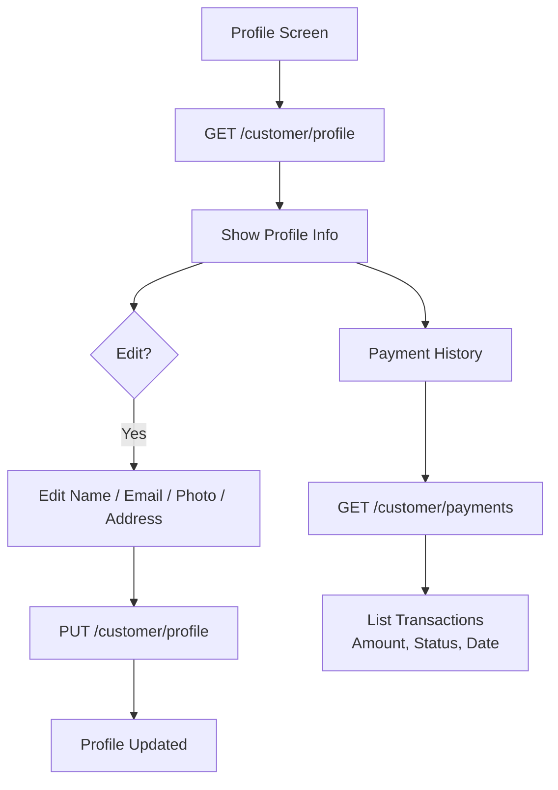

# Customer Workflow

## Overview

Complete customer journey from registration to ride completion and rating. All customer APIs use `/api/customer/*` prefix.

---

## 1. Registration & Authentication



### API Endpoints
- `POST /api/customer/auth/register` — `{ name, phone, email?, password }`
- `POST /api/customer/auth/login` — `{ phone, password }`
- Response: `{ accessToken, user: { _id, name, phone, role } }`

---

## 2. Browse Routes & Cars



---

## 3. Booking Flow



### Create Booking API
```
POST /api/customer/bookings
{
  carId: "...",
  pickup: { address, coordinates?, landmark? },
  drop: { address, coordinates?, landmark? },
  stops: [{ order, address, coordinates? }],
  schedule: { startDate, startTime, endDate?, endTime? },
  estimatedDistanceKm: 195
}
```

---

## 4. Payment Flow (UPI via Razorpay)



---

## 5. Booking Lifecycle



---

## 6. Live Tracking Flow



---

## 7. Cancellation & Refund Flow



---

## 8. Rating Flow



### Rating API
```
POST /api/customer/ratings
{
  bookingId: "...",
  rating: 5,
  review: "Great ride!"
}
```

---

## 9. Profile Management



---

## Complete Customer Journey

```mermaid
flowchart LR
    A[Register/Login] --> B[Browse Routes & Cars]
    B --> C[Create Booking]
    C --> D[Pay via UPI]
    D --> E[Wait for Driver Assignment]
    E --> F[Track Driver Live]
    F --> G[Ride in Progress]
    G --> H[Ride Completed]
    H --> I[Rate Driver]
    I --> J[View Receipt]
```


