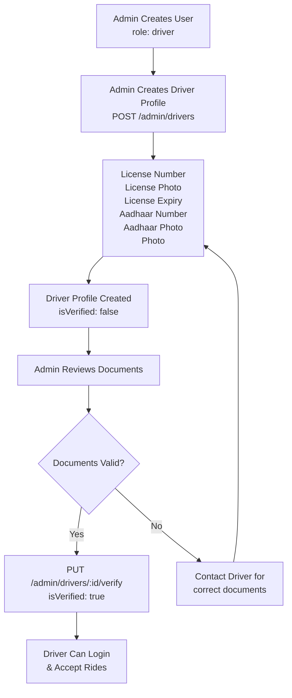
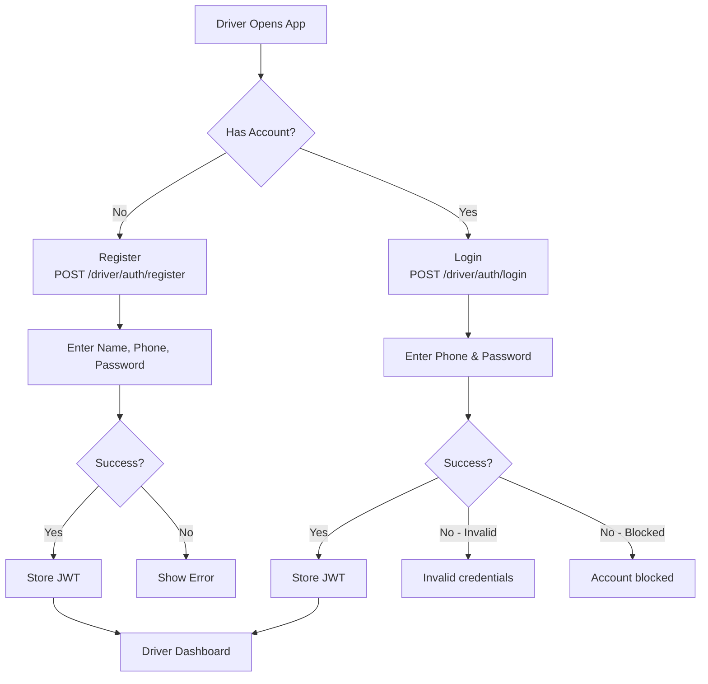
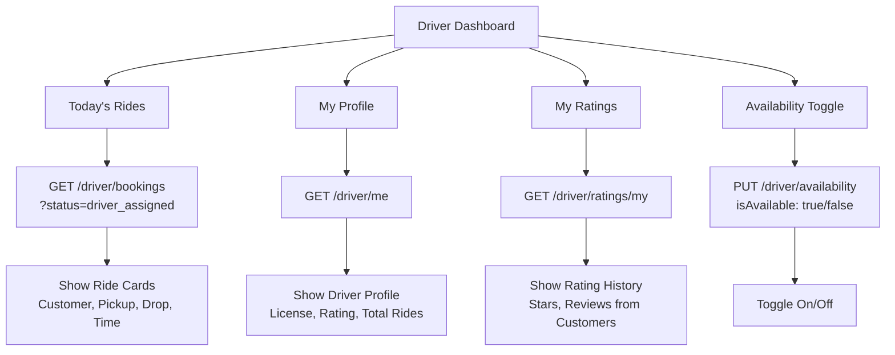
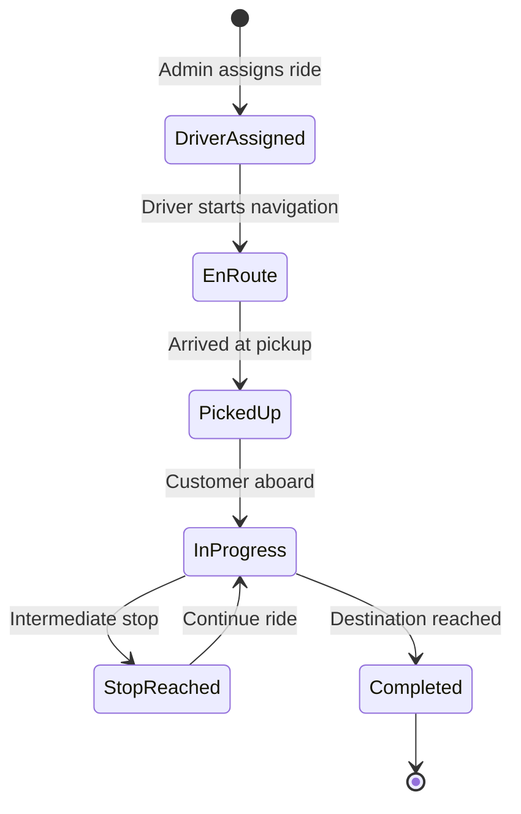
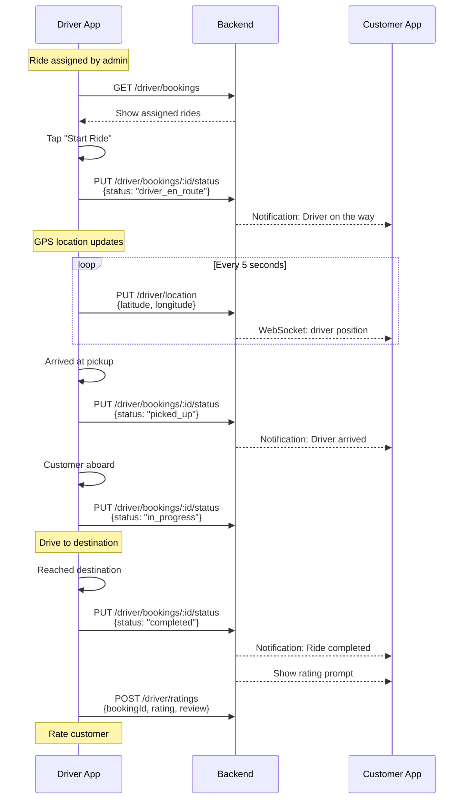
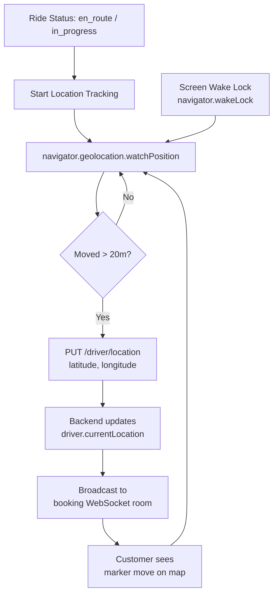
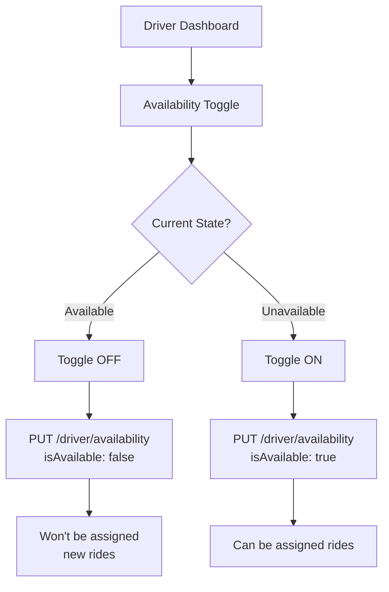
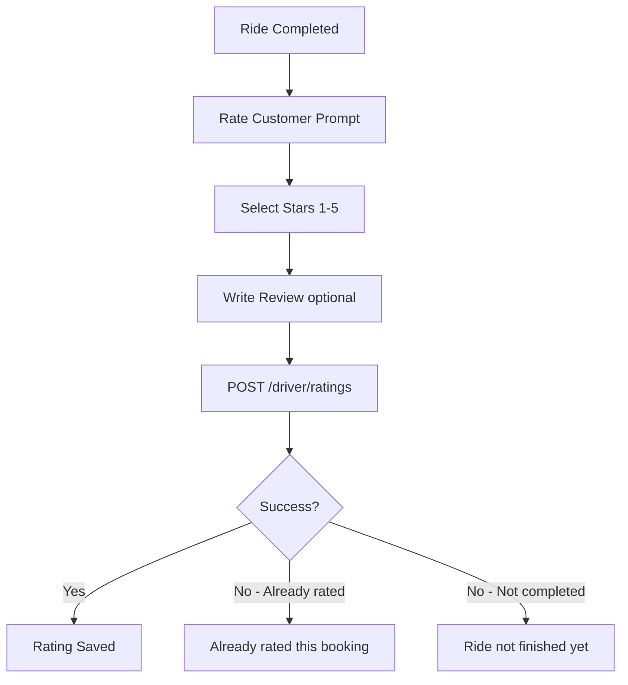
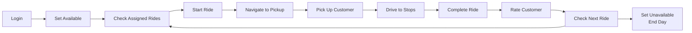

# Driver Workflow

## Overview

Complete driver journey from registration to ride execution. All driver APIs use `/api/driver/*` prefix. Admin creates driver profiles; drivers manage rides and location.

---

## 1. Driver Onboarding



---

## 2. Driver Authentication



---

## 3. Driver Dashboard



---

## 4. Ride Execution Flow





---

## 5. Location Update Flow



### Location API
```
PUT /api/driver/location
{
  latitude: 22.7196,
  longitude: 75.8577
}
```

---

## 6. Availability Management



---

## 7. Rating Customers



---

## 8. Complete Driver Day Flow



---

## Driver API Reference

| Method | Endpoint | Description |
|--------|----------|-------------|
| POST | /driver/auth/register | Register driver account |
| POST | /driver/auth/login | Driver login |
| GET | /driver/profile | Get user profile |
| PUT | /driver/profile | Update user profile |
| GET | /driver/me | Get driver profile (license, rating) |
| PUT | /driver/availability | Toggle availability |
| PUT | /driver/location | Update GPS coordinates |
| GET | /driver/bookings | List assigned bookings |
| GET | /driver/bookings/:id | Get booking detail |
| PUT | /driver/bookings/:id/status | Update ride status |
| POST | /driver/ratings | Rate customer |
| GET | /driver/ratings/my | View received ratings |
