# Admin Workflow

## Overview

Complete admin workflow for managing the car rental platform. All admin APIs use `/api/admin/*` prefix with JWT + admin role guard.

---

## 1. Admin Authentication

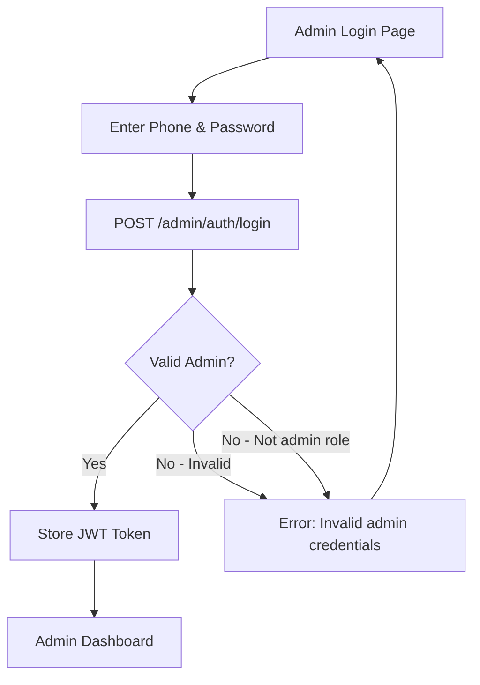

> Admin accounts created via seed script or direct DB. No public registration.

---

## 2. Dashboard Overview

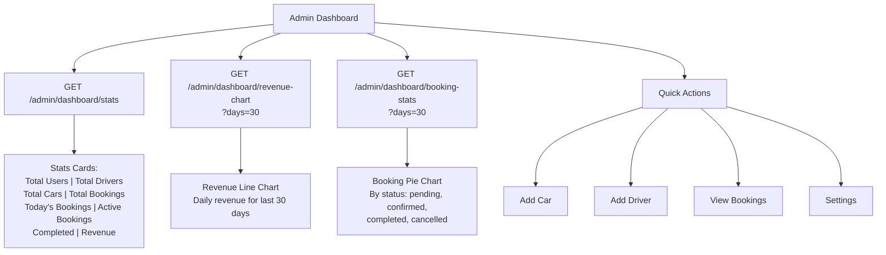

### Dashboard Stats Response
```json
{
  "totalUsers": 150,
  "totalDrivers": 12,
  "totalCars": 8,
  "totalBookings": 340,
  "todayBookings": 5,
  "activeBookings": 3,
  "completedBookings": 285,
  "totalRevenue": 1250000,
  "todayRevenue": 15000
}
```

---

## 3. Car Management

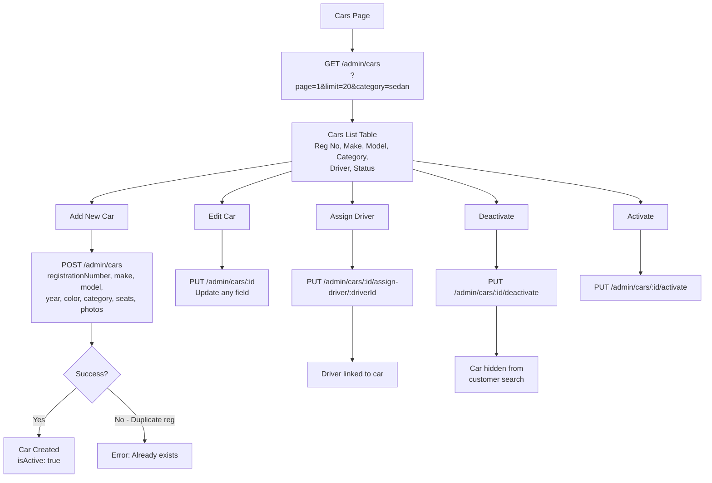

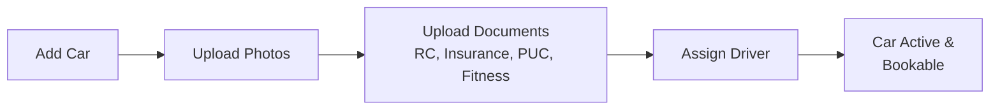

---

## 4. Driver Management

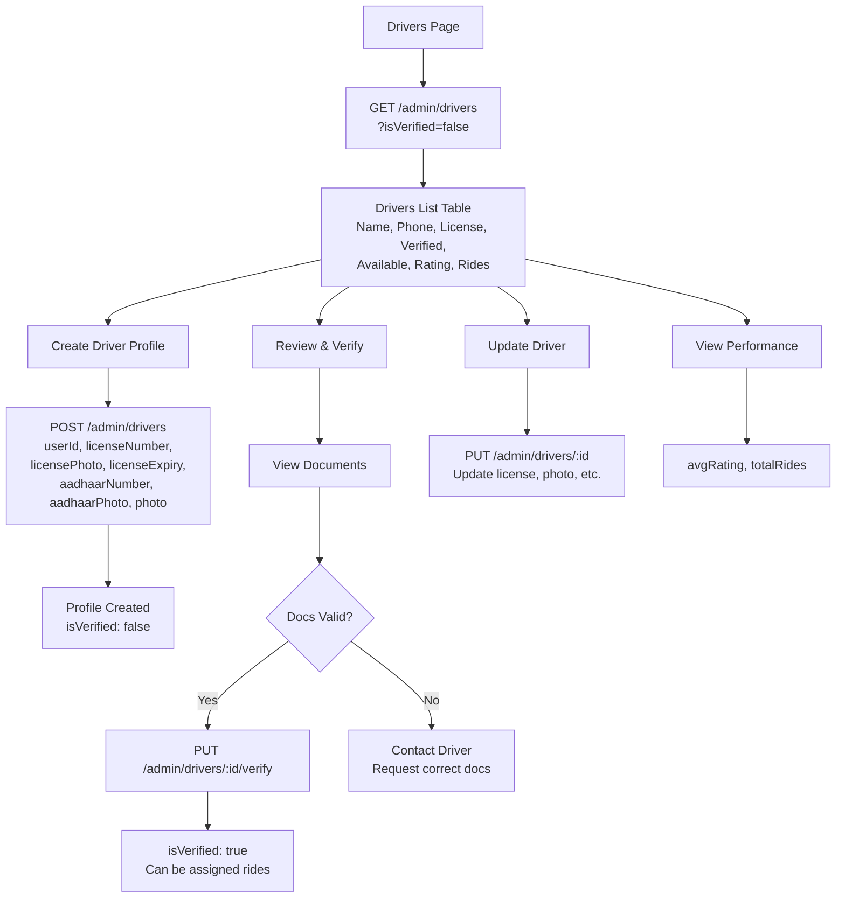

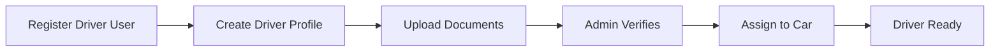

---

## 5. User Management

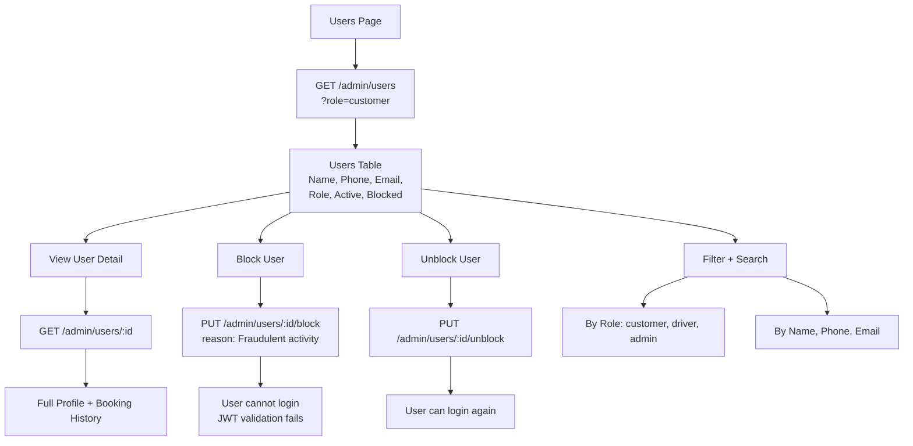

---

## 6. Booking Management

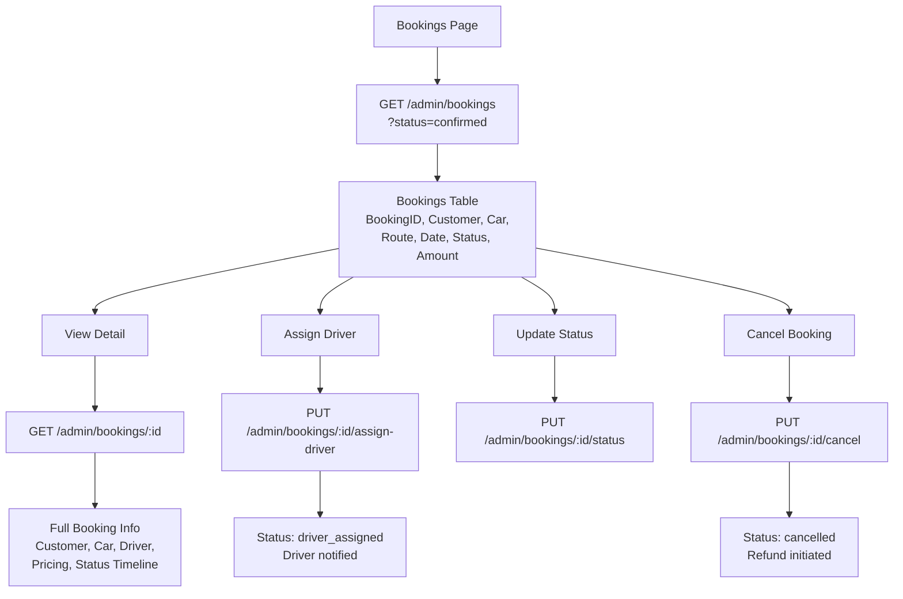

### Booking Assignment Flow

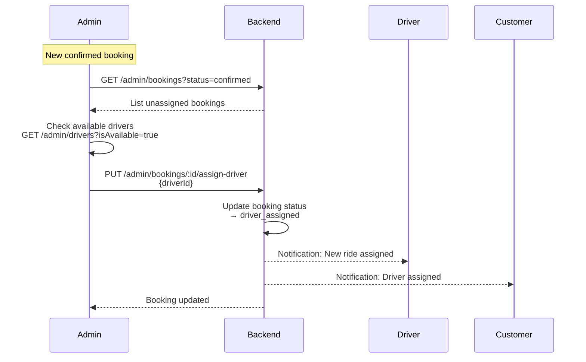

---

## 7. Payment Management

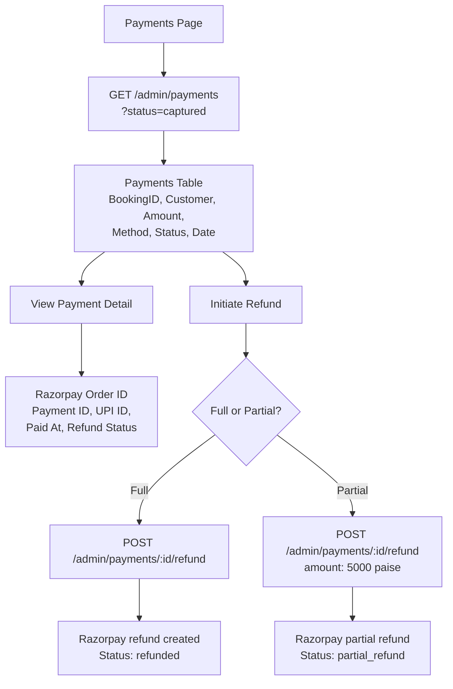

---

## 8. Route Pricing Management

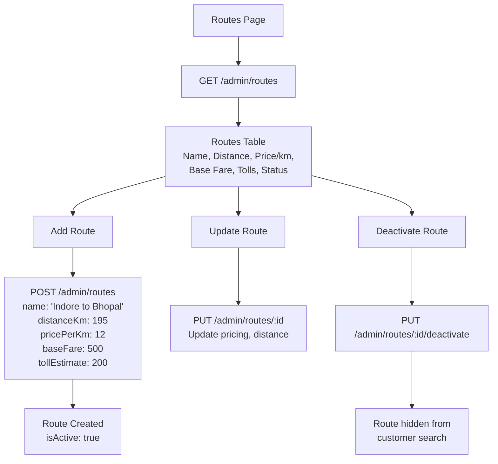

---

## 9. Company Settings

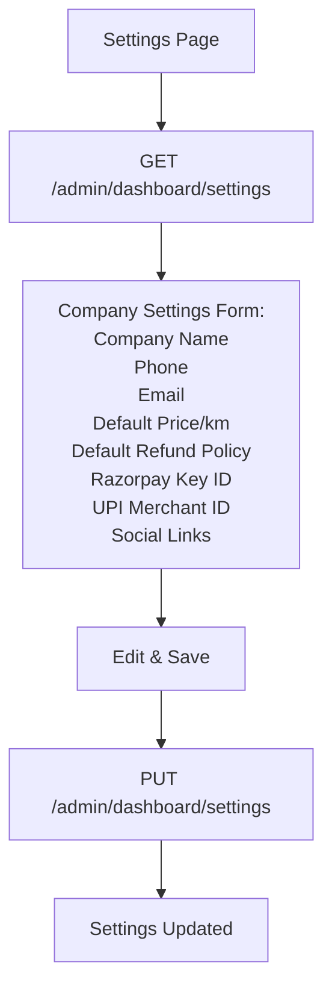

---

## 10. Admin Daily Workflow

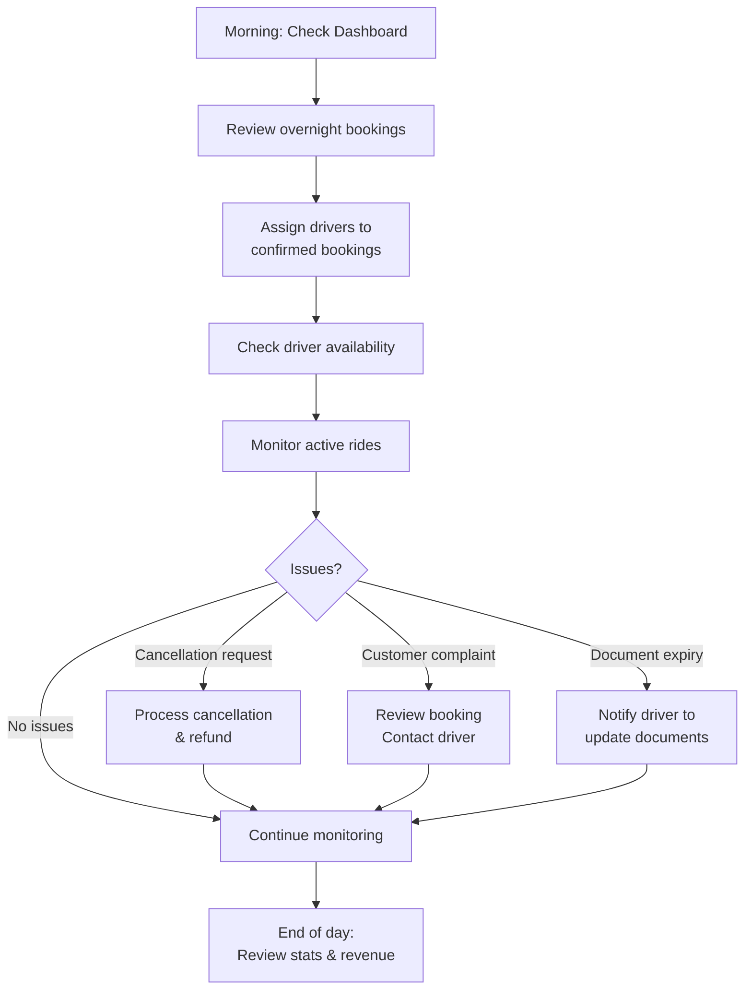

---

## Admin API Reference

| Method | Endpoint | Description |
|--------|----------|-------------|
| POST | /admin/auth/login | Admin login |
| GET | /admin/dashboard/stats | Dashboard statistics |
| GET | /admin/dashboard/revenue-chart | Revenue chart data |
| GET | /admin/dashboard/booking-stats | Booking stats by status |
| GET | /admin/dashboard/settings | Company settings |
| PUT | /admin/dashboard/settings | Update settings |
| GET | /admin/users | List users (paginated, filterable) |
| GET | /admin/users/:id | Get user detail |
| PUT | /admin/users/:id/block | Block user |
| PUT | /admin/users/:id/unblock | Unblock user |
| POST | /admin/cars | Add car |
| GET | /admin/cars | List cars |
| GET | /admin/cars/:id | Get car detail |
| PUT | /admin/cars/:id | Update car |
| PUT | /admin/cars/:id/activate | Activate car |
| PUT | /admin/cars/:id/deactivate | Deactivate car |
| PUT | /admin/cars/:id/assign-driver/:driverId | Assign driver |
| POST | /admin/drivers | Create driver profile |
| GET | /admin/drivers | List drivers |
| GET | /admin/drivers/:id | Get driver detail |
| PUT | /admin/drivers/:id | Update driver |
| PUT | /admin/drivers/:id/verify | Verify driver |
| GET | /admin/bookings | List bookings |
| GET | /admin/bookings/:id | Get booking detail |
| PUT | /admin/bookings/:id/assign-driver | Assign driver |
| PUT | /admin/bookings/:id/status | Update status |
| PUT | /admin/bookings/:id/cancel | Cancel booking |
| GET | /admin/payments | List payments |
| POST | /admin/payments/:id/refund | Initiate refund |
| POST | /admin/routes | Create route pricing |
| GET | /admin/routes | List routes |
| PUT | /admin/routes/:id | Update route |
| PUT | /admin/routes/:id/deactivate | Deactivate route |
